# User Manual

* **Main Panel**

  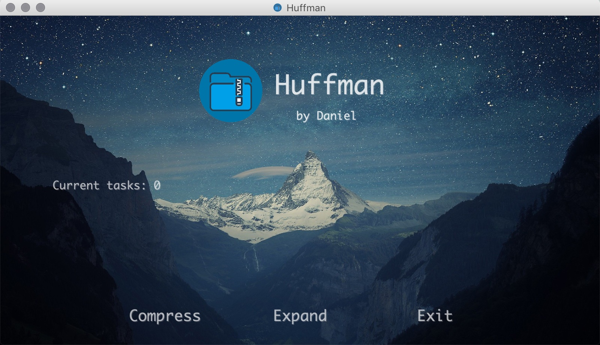

* To **compress**, click the `Compress` button at the left corner.

  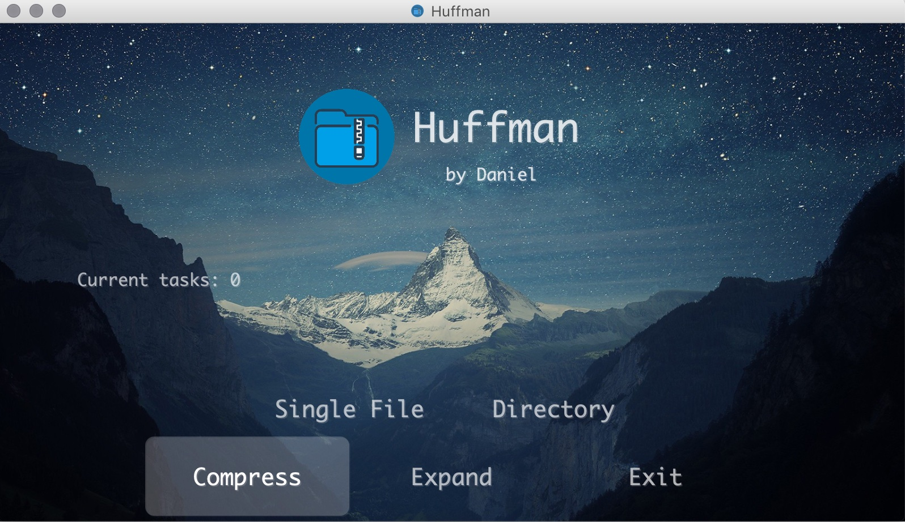

  * If we click `Single File`, we can choose a file to compress.

  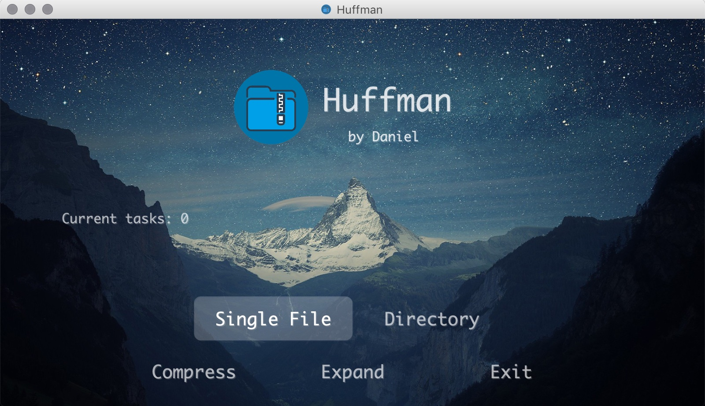

  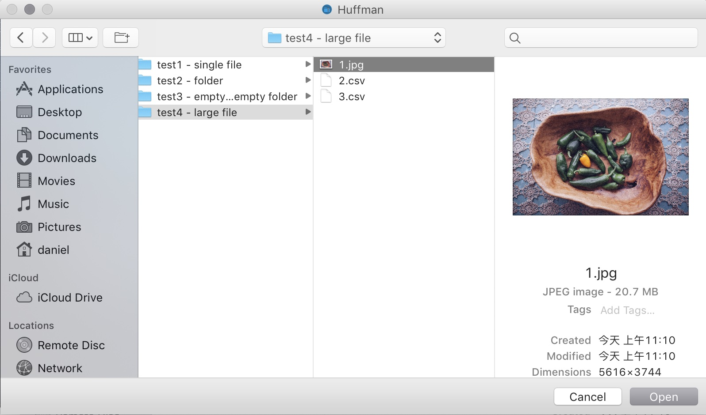

  * Click open and the task will begin. When the task processing, the number of `Current task` will become 1 (because now we have one task processing)

  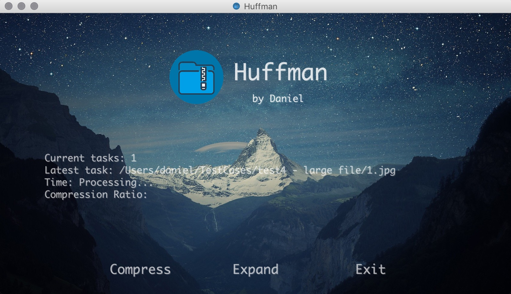

  * When the task completes, the panel will display some information of the latest task (file name, compression time, compretion ratio). 

  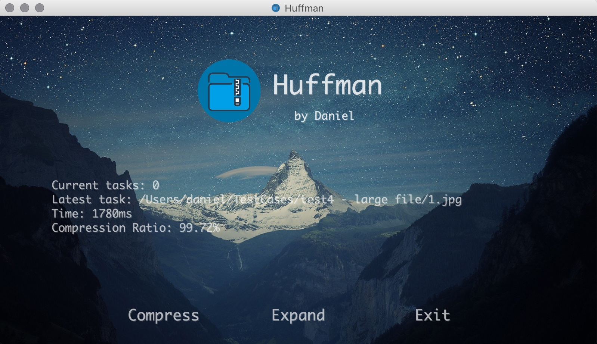

  ​	And we will get the compressed package with `.hfm` suffix.

  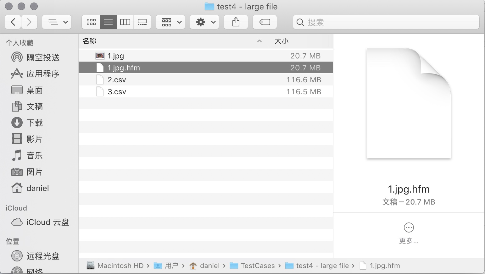
  * For directory compression, the process is nearly the same, except we can only choose a directory to compress instead of a single file.

  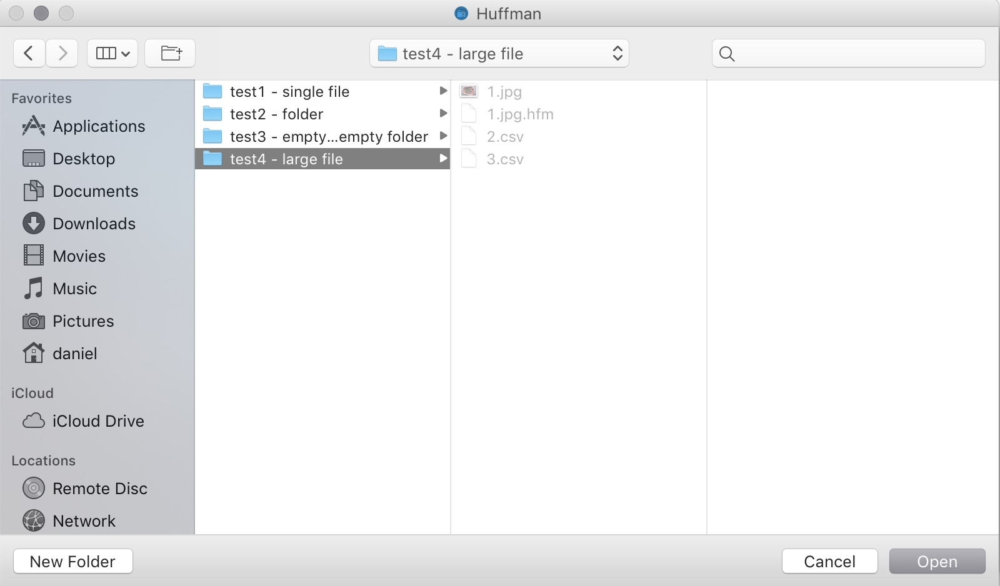

* To **expand**, click the `Expand` button at the center of the bottom. 

  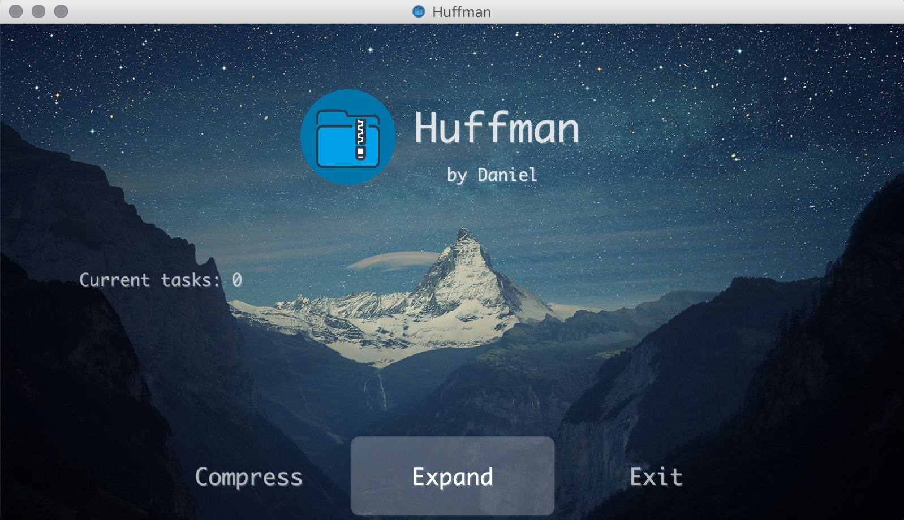

  * Now we can only choose a package with `.hfm` suffix to process.

  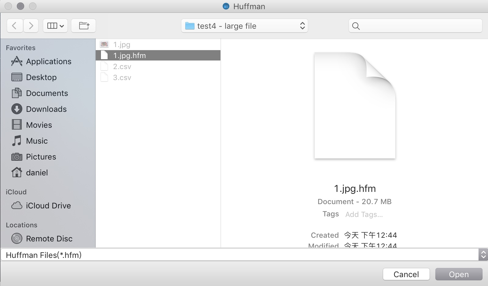

  * The panel will also display related information during processing as well as when the task completes

  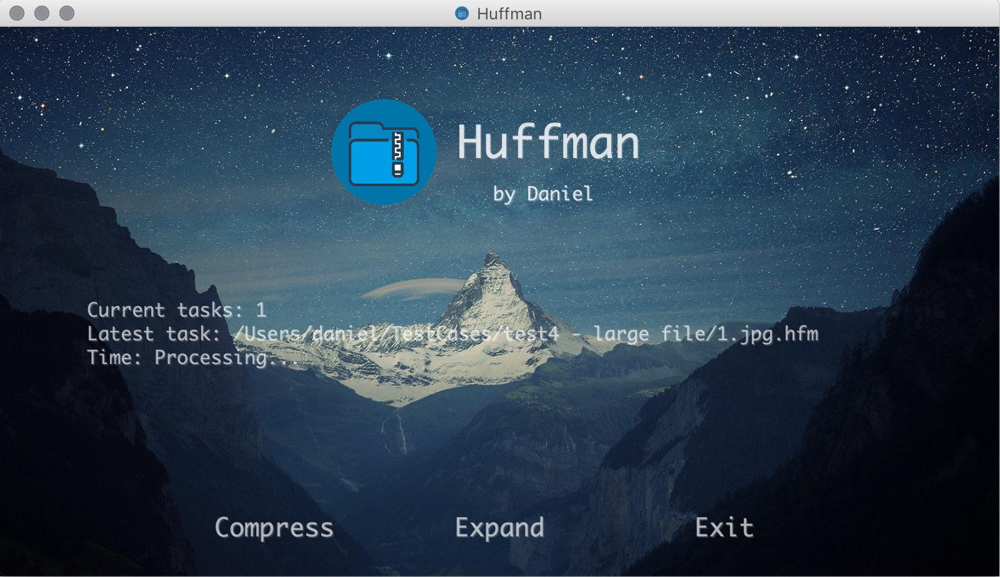

  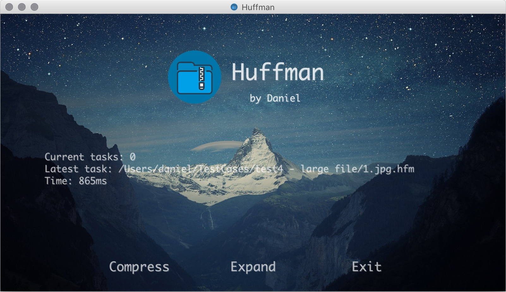

* If we want to exit the program, click the `Exit` button at the right corner of the panel.

  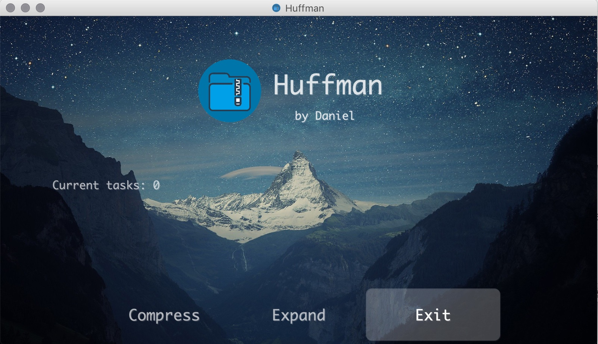